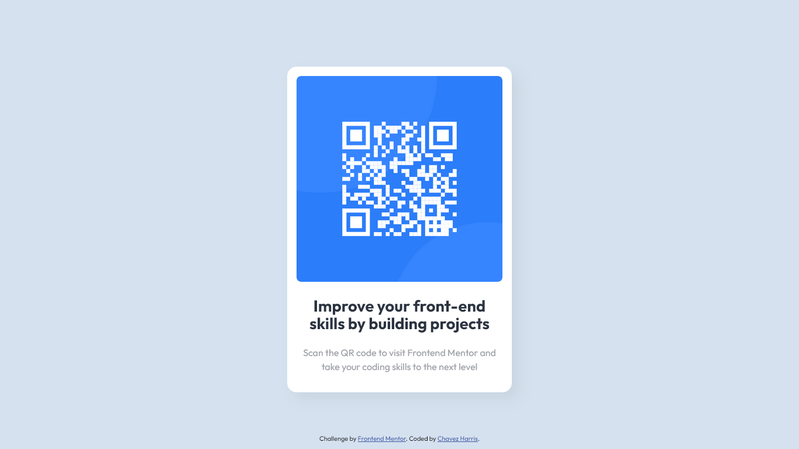
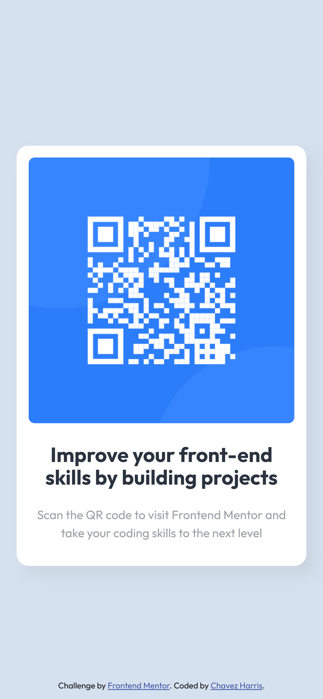

# Frontend Mentor - QR code component solution

This is a solution to the [QR code component challenge on Frontend Mentor](https://www.frontendmentor.io/challenges/qr-code-component-iux_sIO_H). Frontend Mentor challenges help you improve your coding skills by building realistic projects. 

## Table of contents

- [Overview](#overview)
  - [Screenshot](#screenshot)
  - [Links](#links)
- [My process](#my-process)
  - [Built with](#built-with)
  - [What I learned](#what-i-learned)
  - [Continued development](#continued-development)
  - [Useful resources](#useful-resources)
- [Author](#author)
- [Acknowledgments](#acknowledgments)

**Note: Delete this note and update the table of contents based on what sections you keep.**

## Overview

### Screenshot

#### Desktop view

 

#### Mobile view



### Links

- Solution URL: [Solution](https://www.frontendmentor.io/solutions/frontend-mentor-qr-code-component-solution-BdEjefSF0X)
- Live Site URL: [GitHub pages](https://codedbychavez.github.io/qr-code-component/)

## My process

### Built with

- Semantic HTML5 markup
- CSS custom properties
- Flexbox
- Mobile-first workflow
- HTML5

### What I learned

I learnt how to Flexbox's properties to center the card on the page.

To see how you can add code snippets, see below:

```html
  <main>

    <article class="card">
      <picture>
      </picture>
      <div class="card__content">
      </div>
    </article>
  </main>
```
```css
body,
main {
  display: flex;
  justify-content: center;
  align-items: center;
}
```

### Continued development

I am using Kevin Powell's course on Conquering Responsive Layouts to improve my knowledge on Flexbox. I find his course really helpful.

### Useful resources

- [A Complete Guide to Flexbox](https://css-tricks.com/snippets/css/a-guide-to-flexbox/) - Really simple and awesome article by CSS Tricks.
- [Conquering Responsive Layouts](https://courses.kevinpowell.co/view/courses/conquering-responsive-layouts) - This is a 21-day FREE challenge created by Kevin. This has really helped me a whole lot.

## Author

- Website - [Chavez Harris](https://www.codedbychavez.com)
- Frontend Mentor - [@codedbychavez](https://www.frontendmentor.io/profile/codedbychavez)

## Acknowledgments

Hats of to [frontendmentor.io](https://www.frontendmentor.io) and [Kevin Powell](https://kevinpowell.co). You guys rock!

